# .NET 10.0 Upgrade Plan - GrinVideoEncoder

## Table of Contents

- [Executive Summary](#executive-summary)
- [Migration Strategy](#migration-strategy)
- [Detailed Dependency Analysis](#detailed-dependency-analysis)
- [Project-by-Project Plans](#project-by-project-plans)
  - [GrinVideoEncoder.csproj](#grinvideoencodercsproj)
- [Package Update Reference](#package-update-reference)
- [Breaking Changes Catalog](#breaking-changes-catalog)
- [Risk Management](#risk-management)
- [Testing & Validation Strategy](#testing--validation-strategy)
- [Complexity & Effort Assessment](#complexity--effort-assessment)
- [Source Control Strategy](#source-control-strategy)
- [Success Criteria](#success-criteria)

---

## Executive Summary

### Scenario Description

Upgrade the GrinVideoEncoder ASP.NET Core Razor Pages application from **.NET 9.0** to **.NET 10.0 (LTS)**.

### Scope

| Metric | Value |
|--------|-------|
| Total Projects | 1 |
| Total NuGet Packages | 6 |
| Packages Requiring Update | 1 |
| Total Lines of Code | 836 |
| Files with Issues | 3 |
| Total API Issues | 8 |
| Estimated LOC Impact | ~8 lines (1% of codebase) |

### Current State

- **Project**: GrinVideoEncoder.csproj
- **Framework**: net9.0
- **Type**: ASP.NET Core Razor Pages (SDK-style)
- **Key Technologies**: Serilog logging, Xabe.FFmpeg video processing, System.Management (WMI)

### Target State

- **Framework**: net10.0
- **All packages**: Updated to .NET 10 compatible versions
- **All API issues**: Resolved

### Selected Strategy

**All-At-Once Strategy** - Single project upgraded atomically in one operation.

**Rationale**:
- Single project (no dependency ordering needed)
- Small codebase (836 LOC)
- Low difficulty rating (🟢 Low)
- No security vulnerabilities
- Only 1 package requires update
- All packages have .NET 10 compatible versions available

### Complexity Classification

**Simple Solution** - Fast batch approach with 2-3 detail iterations:
- Single project with zero dependencies
- No circular dependencies
- Clear, straightforward upgrade path
- Minimal breaking changes expected

### Critical Issues

| Priority | Issue | Impact |
|----------|-------|--------|
| 🔴 High | Binary incompatible API: `ConfigurationBinder.Get<T>()` | Requires code change in Program.cs |
| 🟡 Medium | Source incompatible APIs: System.Management WMI types | May require recompilation fixes in GpuDetector.cs |
| 🔵 Low | Behavioral change: `UseExceptionHandler()` | May need runtime testing |

---

## Migration Strategy

### Approach Selection

**Selected Approach**: All-At-Once Strategy

This approach is optimal for this solution because:

1. **Single Project**: No dependency ordering concerns - GrinVideoEncoder.csproj has no project dependencies
2. **Small Codebase**: At 836 LOC, the entire codebase can be upgraded, tested, and validated in a single operation
3. **Low Risk Profile**: Only 1 package update required, 83.3% of packages already compatible
4. **No Intermediate States**: The upgrade will be atomic - no need for multi-targeting or phased rollout

### Execution Approach

All upgrade operations will be performed as a **single coordinated batch**:

1. Update project TargetFramework to net10.0
2. Update all package references simultaneously
3. Restore dependencies
4. Build and fix all compilation errors
5. Verify solution builds with 0 errors

### Dependency-Based Ordering

Not applicable - single project with no project-to-project dependencies.

### Parallel vs Sequential

**Sequential within single task** - All operations execute in sequence within one atomic upgrade task.

---

## Detailed Dependency Analysis

### Dependency Graph Summary

```mermaid
flowchart TB
    subgraph solution["GrinVideoEncoder Solution"]
        P1["📦 GrinVideoEncoder.csproj<br/><small>net9.0 → net10.0</small>"]
    end
```



**Structure**: Single standalone project with no project dependencies.

### Project Groupings

| Phase | Projects | Rationale |
|-------|----------|-----------|
| Phase 1 (Atomic) | GrinVideoEncoder.csproj | Only project - upgraded atomically |

### Critical Path

**Direct path**: GrinVideoEncoder.csproj → Done

No critical path complexity - single project upgrade.

### Circular Dependencies

**None detected** - Single project architecture eliminates circular dependency concerns.

---

## Project-by-Project Plans

### GrinVideoEncoder.csproj

#### Current State

| Attribute | Value |
|-----------|-------|
| Target Framework | net9.0 |
| Project Type | ASP.NET Core Razor Pages |
| SDK-style | Yes |
| Lines of Code | 836 |
| Files | 24 |
| Files with Incidents | 3 |
| NuGet Packages | 6 |
| Project Dependencies | 0 |
| Project Dependants | 0 |
| Risk Level | 🟢 Low |

**Key Technologies**:
- ASP.NET Core Razor Pages
- Serilog (structured logging)
- Xabe.FFmpeg (video encoding)
- System.Management (WMI for GPU detection)

#### Target State

| Attribute | Value |
|-----------|-------|
| Target Framework | net10.0 |
| Updated Packages | 1 (System.Management) |
| Expected Breaking Changes | 2 code locations |

#### Migration Steps

**1. Prerequisites**
- Verify .NET 10 SDK is installed
- Ensure upgrade branch `upgrade-to-NET10` is active

**2. Framework Update**
Update `GrinVideoEncoder.csproj`:
```xml
<TargetFramework>net10.0</TargetFramework>
```

**3. Package Updates**
Update package reference in `GrinVideoEncoder.csproj`:

| Package | Current | Target | Action |
|---------|---------|--------|--------|
| System.Management | 9.0.2 | 10.0.1 | Update version |
| Serilog | 4.2.0 | 4.2.0 | No change (compatible) |
| Serilog.AspNetCore | 9.0.0 | 9.0.0 | No change (compatible) |
| Serilog.Sinks.File | 6.0.0 | 6.0.0 | No change (compatible) |
| Xabe.FFmpeg | 6.0.1 | 6.0.1 | No change (compatible) |
| Xabe.FFmpeg.Downloader | 6.0.1 | 6.0.1 | No change (compatible) |

**4. Restore and Build**
```bash
dotnet restore
dotnet build
```

**5. Address Breaking Changes**
Fix compilation errors in the following files:
- `Program.cs` (line 15) - ConfigurationBinder.Get<T>() binary incompatibility
- `Utils\GpuDetector.cs` (lines 23-27) - System.Management source incompatibilities

**6. Runtime Validation**
- Test `UseExceptionHandler("/Error")` behavioral change in `Program.cs` (line 28)

#### Validation Checklist

- [ ] TargetFramework updated to net10.0
- [ ] System.Management updated to 10.0.1
- [ ] Project builds without errors
- [ ] Project builds without warnings
- [ ] Application starts successfully
- [ ] GPU detection functionality works
- [ ] Error handling works correctly

---

## Package Update Reference

### Package Update Summary

| Status | Count | Percentage |
|--------|-------|------------|
| ✅ Compatible (no update needed) | 5 | 83.3% |
| 🔄 Upgrade Recommended | 1 | 16.7% |
| ⚠️ Incompatible | 0 | 0.0% |
| **Total** | **6** | **100%** |

### Detailed Package Updates

#### Packages Requiring Update

| Package | Current Version | Target Version | Projects Affected | Reason |
|---------|-----------------|----------------|-------------------|--------|
| System.Management | 9.0.2 | 10.0.1 | GrinVideoEncoder.csproj | Framework alignment - .NET 10 compatible version |

#### Compatible Packages (No Update Required)

| Package | Version | Projects |
|---------|---------|----------|
| Serilog | 4.2.0 | GrinVideoEncoder.csproj |
| Serilog.AspNetCore | 9.0.0 | GrinVideoEncoder.csproj |
| Serilog.Sinks.File | 6.0.0 | GrinVideoEncoder.csproj |
| Xabe.FFmpeg | 6.0.1 | GrinVideoEncoder.csproj |
| Xabe.FFmpeg.Downloader | 6.0.1 | GrinVideoEncoder.csproj |

---

## Breaking Changes Catalog

### Summary by Severity

| Category | Count | Impact |
|----------|-------|--------|
| 🔴 Binary Incompatible | 1 | High - Requires code changes |
| 🟡 Source Incompatible | 6 | Medium - May require recompilation fixes |
| 🔵 Behavioral Change | 1 | Low - May require runtime testing |

### Binary Incompatible APIs (🔴 High Priority)

#### 1. ConfigurationBinder.Get&lt;T&gt;()

| Attribute | Details |
|-----------|---------|
| **API** | `Microsoft.Extensions.Configuration.ConfigurationBinder.Get<T>(IConfiguration)` |
| **File** | `Program.cs` |
| **Line** | 15 |
| **Current Code** | `var appSettings = builder.Configuration.GetSection("Settings").Get<AppSettings>() ?? throw new Exception("Failed to load Application Settings");` |
| **Issue** | Binary incompatibility in .NET 10 |
| **Resolution** | Review breaking change documentation and update method call if signature changed |
| **Reference** | https://go.microsoft.com/fwlink/?linkid=2262679 |

### Source Incompatible APIs (🟡 Medium Priority)

All located in `Utils\GpuDetector.cs`:

| # | API | Line | Issue |
|---|-----|------|-------|
| 1 | `ManagementObjectSearcher.#ctor(String)` | 23 | Constructor may have changed |
| 2 | `ManagementObjectSearcher` (type) | 23 | Type reference may need update |
| 3 | `ManagementObjectSearcher.Get()` | 24 | Method may have changed |
| 4 | `ManagementObjectCollection` (type) | 24 | Collection type may have changed |
| 5 | `ManagementBaseObject.Item[String]` | 26 | Indexer may have changed |
| 6 | `ManagementBaseObject.Item[String]` | 27 | Indexer may have changed |

**Current Code Pattern**:
```csharp
using ManagementObjectSearcher searcher = new("SELECT * FROM Win32_VideoController");
foreach (var obj in searcher.Get().Cast<ManagementObject>())
{
    string name = obj["Name"]?.ToString() ?? "";
    string adapterCompatibility = obj["AdapterCompatibility"]?.ToString() ?? "";
    // ...
}
```

**Resolution**: These source incompatibilities are typically resolved by updating the `System.Management` package to 10.0.1 and recompiling. If compilation errors occur, follow the breaking changes documentation.

### Behavioral Changes (🔵 Low Priority)

#### 1. UseExceptionHandler()

| Attribute | Details |
|-----------|---------|
| **API** | `Microsoft.AspNetCore.Builder.ExceptionHandlerExtensions.UseExceptionHandler(IApplicationBuilder, String)` |
| **File** | `Program.cs` |
| **Line** | 28 |
| **Current Code** | `app.UseExceptionHandler("/Error");` |
| **Issue** | Behavioral change - error handling behavior may differ |
| **Resolution** | Test error scenarios at runtime to verify expected behavior |

---

## Risk Management

### Risk Assessment Summary

| Risk Level | Projects | Description |
|------------|----------|-------------|
| 🟢 Low | GrinVideoEncoder.csproj | Small codebase, minimal breaking changes, single package update |

### High-Risk Changes

| Item | Risk Level | Description | Mitigation |
|------|------------|-------------|------------|
| ConfigurationBinder.Get&lt;T&gt;() | 🟡 Medium | Binary incompatible API in Program.cs | Review .NET 10 breaking changes docs; update configuration binding pattern if needed |
| System.Management APIs | 🟢 Low | Source incompatible WMI APIs | Package update to 10.0.1 should resolve; recompile and fix any remaining issues |
| UseExceptionHandler behavior | 🟢 Low | Behavioral change in error handling | Runtime testing of error scenarios |

### Security Vulnerabilities

**None detected** ✅

No NuGet packages have known security vulnerabilities.

### Contingency Plans

| Scenario | Response |
|----------|----------|
| Build fails after upgrade | Check compiler errors against breaking changes catalog; consult .NET 10 migration docs |
| ConfigurationBinder change breaks startup | Use explicit binding options or alternative configuration patterns |
| WMI functionality breaks | Review System.Management 10.0.1 release notes; consider P/Invoke alternatives if needed |
| Performance regression | Profile application; compare against .NET 9 baseline |

### Rollback Strategy

If critical issues are encountered:
1. Discard changes on `upgrade-to-NET10` branch
2. Return to `main` branch with .NET 9 codebase
3. Investigate issues before re-attempting

---

## Testing & Validation Strategy

### Validation Phases

#### Phase 1: Build Validation (Automated)

| Check | Expected Result |
|-------|-----------------|
| `dotnet restore` | All packages restored successfully |
| `dotnet build` | Build succeeds with 0 errors |
| Build warnings | 0 new warnings introduced |

#### Phase 2: Runtime Validation (Manual)

| Test | Expected Result |
|------|-----------------|
| Application startup | App starts without exceptions |
| Configuration loading | AppSettings loads correctly from appsettings.json |
| GPU detection | `GpuDetector` correctly identifies GPU vendor |
| Error handling | `/Error` page displays correctly for unhandled exceptions |
| Video encoding | FFmpeg operations function correctly |

### Test Projects

**None detected** in solution.

Since no test projects exist, validation relies on:
1. Successful build
2. Manual runtime verification of key functionality

### Smoke Test Checklist

After upgrade completes:
- [ ] Application starts without errors
- [ ] Home page loads
- [ ] Logging works (check Serilog output)
- [ ] GPU detection returns valid result
- [ ] Video encoding functionality works

---

## Complexity & Effort Assessment

### Project Complexity

| Project | Complexity | LOC | Dependencies | Package Updates | API Issues | Risk |
|---------|------------|-----|--------------|-----------------|------------|------|
| GrinVideoEncoder.csproj | 🟢 Low | 836 | 0 | 1 | 8 | Low |

### Overall Assessment

| Factor | Rating | Notes |
|--------|--------|-------|
| Solution Complexity | 🟢 Low | Single project, no dependencies |
| Breaking Change Impact | 🟢 Low | ~8 LOC to modify (1% of codebase) |
| Package Compatibility | 🟢 Low | 83% packages already compatible |
| Risk Level | 🟢 Low | No security vulnerabilities, clear upgrade path |

### Resource Requirements

| Requirement | Level |
|-------------|-------|
| .NET Knowledge | Intermediate |
| ASP.NET Core Knowledge | Intermediate |
| Parallel Capacity | N/A (single project) |

---

## Source Control Strategy

### Branch Strategy

| Branch | Purpose |
|--------|---------|
| `main` | Source branch - current .NET 9 codebase |
| `upgrade-to-NET10` | Upgrade branch - all changes applied here |

### Commit Strategy

**Single Commit Approach** (recommended for All-At-Once strategy):

All upgrade changes committed in a single atomic commit:
- Framework update
- Package updates
- Code fixes for breaking changes

**Commit Message Format**:
```
Upgrade to .NET 10.0

- Update TargetFramework from net9.0 to net10.0
- Update System.Management from 9.0.2 to 10.0.1
- Fix ConfigurationBinder.Get<T>() breaking change
- Address System.Management API changes
```

### Review and Merge Process

1. **Before Merge**:
   - All builds pass
   - Manual validation complete
   - Breaking changes addressed

2. **Merge Approach**:
   - Create Pull Request from `upgrade-to-NET10` to `main`
   - Review changes
   - Squash merge to keep clean history

---

## Success Criteria

### Technical Criteria

| Criterion | Required |
|-----------|----------|
| TargetFramework updated to net10.0 | ✅ Yes |
| All package updates applied | ✅ Yes |
| Solution builds with 0 errors | ✅ Yes |
| Solution builds with 0 new warnings | ✅ Yes |
| No package dependency conflicts | ✅ Yes |
| No security vulnerabilities | ✅ Yes (already met) |

### Quality Criteria

| Criterion | Required |
|-----------|----------|
| Code quality maintained | ✅ Yes |
| All breaking changes addressed | ✅ Yes |
| Application starts successfully | ✅ Yes |
| Core functionality works | ✅ Yes |

### Process Criteria

| Criterion | Required |
|-----------|----------|
| All-At-Once strategy followed | ✅ Yes |
| Single atomic commit | ✅ Yes |
| Changes on upgrade branch | ✅ Yes |

### Definition of Done

The .NET 10.0 upgrade is **complete** when:

1. ✅ `GrinVideoEncoder.csproj` targets `net10.0`
2. ✅ `System.Management` updated to `10.0.1`
3. ✅ All compilation errors fixed
4. ✅ Solution builds successfully
5. ✅ Application starts and runs correctly
6. ✅ All changes committed to `upgrade-to-NET10` branch
7. ✅ Ready for PR to `main`
